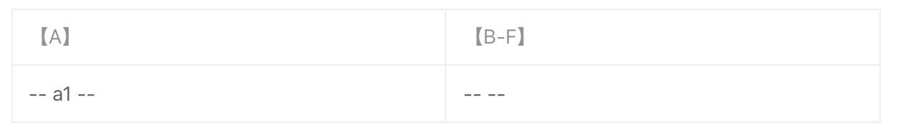
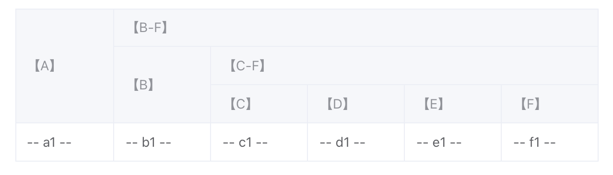

+++
slug = 'element-plus-table-nested-column'
title = 'el-table表头分组实现'
date = 2024-09-19T20:18:47+08:00
draft = false
tags = ['element-plus', 'table']
categories = ['踩坑心得']
+++

`element-plus` 的 `Table` 组件（特指 v1 版本）不支持配置式渲染表格列，只能通过声明式嵌套 `el-table-column` 来实现表头分组功能：

```vue
// 官网示例
<template>
  <el-table :data="tableData" style="width: 100%">
    <el-table-column prop="date" label="Date" width="150" />
    <el-table-column label="Delivery Info">
      <el-table-column prop="name" label="Name" width="120" />
      <el-table-column label="Address Info">
        <el-table-column prop="state" label="State" width="120" />
        <el-table-column prop="city" label="City" width="120" />
        <el-table-column prop="address" label="Address" />
        <el-table-column prop="zip" label="Zip" width="120" />
      </el-table-column>
    </el-table-column>
  </el-table>
</template>

<script lang="ts" setup>
const tableData = [
  {
    date: "2016-05-03",
    name: "Tom",
    state: "California",
    city: "Los Angeles",
    address: "No. 189, Grove St, Los Angeles",
    zip: "CA 90036",
  },
  // ...
];
</script>
```

对于数据驱动表格列渲染业务场景，具体有几层 `el-table-column` 嵌套完全由数据决定，自然而然会想到使用递归。而 `template` 中没法直接使用函数递归渲染 `el-table-column` 组件，需要将 `template` 改为 `render` 函数或 `jsx/tsx` 形式，对页面改动较大，最理想的方式还是封装一个独立组件，将递归渲染 `el-table-column` 的逻辑抽取到独立组件中。

### 组件封装

我们简单封装一个名为 `NestedColumn` 的组件，该组件接收嵌套的表格列属性，同时需要暴露`el-table-column` 的 3 个插槽：

```vue
// @filename: NestedColumn.vue
<template>
  <el-table-column
    v-for="column in props.columns"
    :key="column.prop"
    :prop="column.prop"
    :label="column.label"
  >
    <template #header="slotProps">
      <slot name="header" v-bind="slotProps"></slot>
    </template>
    <template #filter-icon="slotProps">
      <slot name="filter-icon" v-bind="slotProps"></slot>
    </template>
    <template #default="slotProps">
      <NestedColumn :columns="column.children" v-if="column.children?.length">
        <template #header="nestedSlotProps">
          <slot name="header" v-bind="nestedSlotProps"></slot>
        </template>
        <template #filter-icon="nestedSlotProps">
          <slot name="filter-icon" v-bind="nestedSlotProps"></slot>
        </template>
        <template #default="nestedSlotProps">
          <slot v-bind="nestedSlotProps"></slot>
        </template>
      </NestedColumn>
      <slot v-bind="slotProps" v-else></slot>
    </template>
  </el-table-column>
</template>

<script setup lang="tsx">
import { ElTableColumn } from "element-plus";

interface INestedColumn {
  // 这边仅选取prop和label两个属性做演示
  prop: string;
  label: string;
  children?: INestedColumn[];
}

interface INestedColumnProps {
  columns: INestedColumn[];
}

const props = defineProps<INestedColumnProps>();
</script>
```

代码看起来封装得没啥问题，测试一下：

```vue
<template>
  <el-table :data="tableData" border style="width: 100%">
    <NestedColumn :columns="columns">
      <template #header="{ column }"> 【{{ column.label }}】 </template>
      <template #default="{ row, column }">
        -- {{ row[column.property] }} --
      </template>
    </NestedColumn>
  </el-table>
</template>

<script lang="ts" setup>
import NestedColumn from "./NestedColumn.vue";

const columns = [
  {
    label: "A",
    prop: "a",
  },
  {
    label: "B-F",
    prop: "bf",
    children: [
      {
        label: "B",
        prop: "b",
      },
      {
        label: "C-F",
        prop: "cf",
        children: [
          {
            label: "C",
            prop: "c",
          },
          {
            label: "D",
            prop: "d",
          },
          {
            label: "E",
            prop: "e",
          },
          {
            label: "F",
            prop: "f",
          },
        ],
      },
    ],
  },
];

const tableData = [
  {
    a: "a1",
    b: "b1",
    c: "c1",
    d: "d1",
    e: "e1",
    f: "f1",
  },
];
</script>
```

并没有得到我们想要的效果：



### 问题分析

翻阅 `el-table` 源码，会发现 `el-table-column` 的 render 函数中有守卫条件：


// @filename: table/src/table-column/index.ts
render() {
  try {
    const renderDefault = this.$slots.default?.({
      row: {},
      column: {},
      $index: -1,
    })
    const children = []
    if (Array.isArray(renderDefault)) {
      for (const childNode of renderDefault) {
        if (
          childNode.type?.name === 'ElTableColumn' ||
          childNode.shapeFlag & 2
        ) {
          children.push(childNode)
        } else if (
          childNode.type === Fragment &&
          Array.isArray(childNode.children)
        ) {
          childNode.children.forEach((vnode) => {
            // No rendering when vnode is dynamic slot or text
            if (vnode?.patchFlag !== 1024 && !isString(vnode?.children)) {
              children.push(vnode)
            }
          })
        }
      }
    }
    const vnode = h('div', children)
    return vnode
  } catch {
    return h('div', [])
  }
},


`el-table-column` render 函数中判断了子节点只能是 `el-table-column` 或函数式组件，猜测可能是因为`el-table` 的实现机制是声明式组件嵌套，而非配置式传入表格列属性，为了过滤掉插槽中的无效节点。递归组件因不符合条件而被过滤掉，于是我们的思路就转变为用函数式组件重新封装组件。

### 组件重构

```tsx
import type { SetupContext, PropType } from "vue";

interface INestedColumn {
  prop: string;
  label: string;
  minWidth?: number;
  children?: INestedColumn[];
}

interface INestedColumnProps {
  columns: INestedColumn[];
}

export default function NestedColumn(
  props: INestedColumnProps,
  { slots }: SetupContext
) {
  return props.columns.map(({ prop, label, minWidth, children }) => (
    <el-table-column prop={prop} label={label} key={prop} minWidth={minWidth}>
      {{
        header: (slotProps) => slots.header?.(slotProps),
        "filter-icon": (slotProps) => slots["filter-icon"]?.(slotProps),
        default: (slotProps) =>
          children?.length ? (
            <NestedColumn columns={children}>
              {{
                header: (nestedSlotProps) => slots.header?.(nestedSlotProps),
                "filter-icon": (nestedSlotProps) =>
                  slots["filter-icon"]?.(nestedSlotProps),
                default: (nestedSlotProps) => slots.default?.(nestedSlotProps),
              }}
            </NestedColumn>
          ) : (
            slots.default?.(slotProps)
          ),
      }}
    </el-table-column>
  ));
}

// 函数式组件最好定义props，不然vue不会将属性转为驼峰形式
NestedColumn.props = {
  columns: {
    type: Array as PropType<INestedColumn[]>,
    required: true,
  },
};
```

测试一下效果：

```vue
<template>
  <el-table :data="tableData" border style="width: 100%">
    <NestedColumn :columns="columns">
      <template #header="{ column }"> 【{{ column.label }}】 </template>
      <template #default="{ row, column }">
        -- {{ row[column.property] }} --
      </template>
    </NestedColumn>
  </el-table>
</template>

<script lang="ts" setup>
import NestedColumn from "./NestedColumn";

// ...同上
</script>
```



### 总结

`el-table` 没有提供配置式渲染嵌套表格列方式，封装独立组件递归渲染表格列实现表头分组功能只能使用函数式组件方式。
