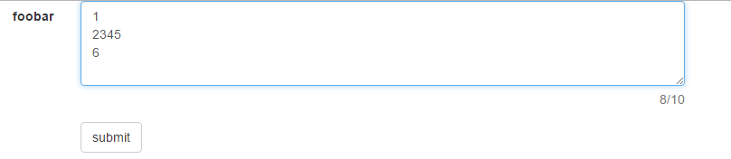
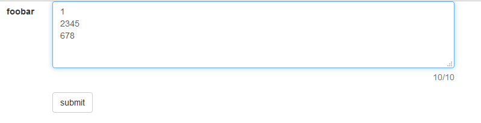

+++
slug = 'textarea-maxlength'
title = 'textarea的maxlength属性'
date = 2016-12-14T20:14:19+08:00
draft = false
categories = ['踩坑心得']
tags = ['Textarea', 'Maxlength']
image = 'cover.png'
+++

做web项目时，我们经常遇到多行文本框限制输入字符的最大长度，并且统计用户输入字数的需求。

在AngularJS项目中，我经常这么写：

```html
<form class="form-horizontal" name="form" novalidate>
  <div class="form-group">
    <label class="col-xs-2 control-label">foobar</label>
    <div class="col-xs-6">
      <textarea class="form-control" name="foo" cols="10" rows="4" 
        ng-model="bar" maxlength="10"></textarea>
      <div class="help-block">
        <span class="pull-right">{{bar.length || 0}}/10</span>
      </div>
    </div>
  </div>
  <div class="form-group">
    <div class="col-xs-6 col-xs-offset-2">
      <button class="btn btn-default">submit</button>
    </div>
  </div>
</form>
```

利用 `maxlength` 属性来限制长度，ng的双向绑定来统计字数，不用写JS就能实现需求。然而，这种做法存在一个很大的弊端：**用户在多行文本框中敲击回车后，不同浏览器允许输入的字符数不一致，字符统计看起来也很有问题。**

## 问题

设置 `maxlength = 10` ，

**Chrome**: 可输入6个字符+2个换行符



**FireFox**: 可输入8个字符+2个换行符



用户可能会有这样的疑问：在chrome中明明已经不能再输入了，字符统计为何是8个字符，而不是10个字符？

## 分析

产生上面这种情况的原因还得从 [HTML](https://html.spec.whatwg.org/multipage/forms.html#the-textarea-element) 规范说起：
> For historical reasons, the element's value is normalized in three different ways for three different purposes. The raw value is the value as it was originally set. It is not normalized. The API value is the value used in the value IDL attribute, textLength IDL attribute, and by the maxlength and minlength content attributes. It is normalized so that line breaks use U+000A LINE FEED (LF) characters. Finally, there is the value, as used in form submission and other processing models in this specification. It is normalized so that line breaks use U+000D CARRIAGE RETURN U+000A LINE FEED (CRLF) character pairs, and in addition, if necessary given the element's wrap attribute, additional line breaks are inserted to wrap the text at the given width.

上面这段大致是说：**`textarea` 有三种形式的值用于不同场景,一种是原始值( `raw value` ); 一种是 `API value` ,用于JavaScript计算（个人理解应该说的是这么回事），被规范为使用 `\n` 表示换行符；还有一种是 `value` ，用于表单提交等场景，使用 `\r\n` 表示换行符**。

回到上面的用例，个人感觉这里是因为chrome没有遵循规范说的 `API value` 用于 `maxlength` 等属性，使用 `\n` 表示换行符。即换行符应该只计算1个字符长度的，chrome还是按2个字符长度计算。而字符统计因为归根结底还是 `AngularJS` 调用JavaScript去计算字符长度了，获取的其实是正确的字符长度。当然，以上只是我个人的猜测，真实原因我还没翻阅到相关资料，只找到一篇探讨 `textarea maxlength` 属性的博文 [MAXLENGTH ON HTML TEXTAREA FORM ELEMENT](http://ashleyglee.com/maxlength-on-html-textarea-form-element/) , 作者的想法跟我正好相反，她认为chrome允许输入6个字符+2个换行符才是正确的，这里就仁者见仁吧。

## 解决方案

好了，既然知道 `maxlength` 存在这么一个坑，而且也大概知道这个坑产生的原因了，那么怎么填坑呢？
我在 `AngularJS` 项目中采用的是添加自定义指令的方式(借鉴自 [angular-maxlength](https://github.com/hanford/angular-maxlength))：

```js
app.directive('myMaxlength', function() {
  return {
    require: 'ngModel',
    link: function (scope, element, attrs, ngModelCtrl) {
      var maxlength = Number(attrs.myMaxlength)
      function enforceML (data) {
          if (data.length > maxlength) {
            var transformedInput = data.substring(0, maxlength);
            ngModelCtrl.$setViewValue(transformedInput);
            ngModelCtrl.$render();
            return transformedInput;
          }
          return data;
      }
      ngModelCtrl.$parsers.push(enforceML);
    }
  }
});
```
然后在页面中使用 `my-maxlength` 代替 `maxlength`：
```html
<form class="form-horizontal" name="form" novalidate>
  <div class="form-group">
      <label class="col-xs-2 control-label">foobar</label>
      <div class="col-xs-6">
          <textarea class="form-control" name="foo" cols="10" rows="4" 
            ng-model="bar" my-maxlength="10"></textarea>
          <div class="help-block">
              <span class="pull-right">{{bar.length || 0}}/10</span>
          </div>
      </div>
    </div>
    <div class="form-group">
      <div class="col-xs-6 col-xs-offset-2">
        <button class="btn btn-default">submit</button>
      </div>
    </div>
</form>
```

至于 `jQuery` 等其他框架或类库，可以使用 [bootstrap-maxlength](https://github.com/mimo84/bootstrap-maxlength) 等插件。
**注意**: 以上解决方案主要适用于使用JavaScript提交表单数据，对于直接form提交，因为不涉及JavaScript，`textarea` 换行符在不同平台可能是`\r\n` ,也可能是 `\n` ,导致的问题得另行分析解决。

## 参考

- [HTML Living Standard](https://html.spec.whatwg.org/multipage/form-elements.html#the-textarea-element)
- [MAXLENGTH ON HTML TEXTAREA FORM ELEMENT](http://ashleyglee.com/maxlength-on-html-textarea-form-element/)
- [Ask Ben: Javascript Replace And Multiple Lines / Line Breaks](https://www.bennadel.com/blog/161-ask-ben-javascript-replace-and-multiple-lines-line-breaks.htm)